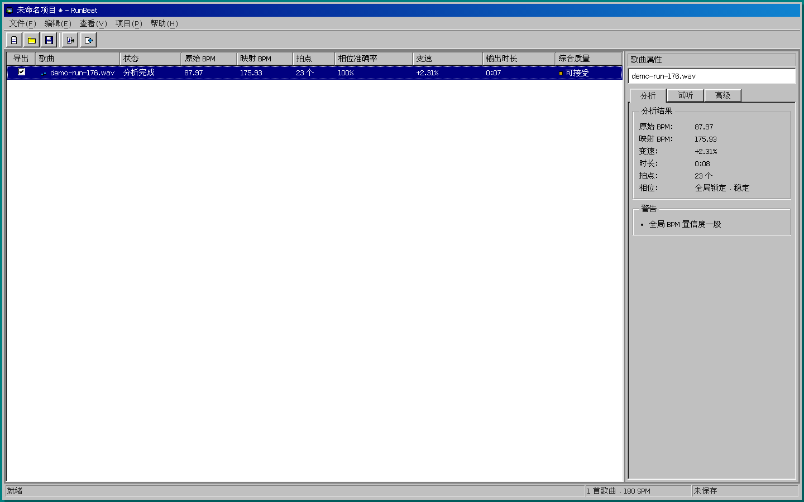

<div align="center">
  
  <h1>RunBeat</h1>
  <p><strong>在浏览器中，把自己的音乐制作成固定步频的跑步混音。</strong></p>
  <p>Local-first running music builder with beat analysis, pitch-preserving time stretch and MP3/WAV/cover-video export.</p>

  <p>
    <a href="./package.json"></a>
    <a href="./LICENSE"></a>
    
  </p>
</div>

RunBeat 是一款本地优先的跑步音乐制作工具。导入歌曲并设置目标步频
（SPM）后，它会在浏览器内完成 BPM 与拍点分析、half-time / double-time
映射、保持音高的变速、相位校准、节拍轨混合和响度处理，最后导出连续跑步
音乐或处理后的单曲。

音频文件不会上传到服务器。分析、试听、项目存储和最终渲染均在当前设备完成。



> [!NOTE]
> RunBeat 当前处于 `0.1.1` 早期版本。它更适合节拍稳定的流行、电子、摇滚和
> Hip-Hop 音乐；现场录音、自由速度音乐或中途明显变速的歌曲可能需要手动校准。

## 主要功能

- **本地音频分析**：使用 Essentia.js / WebAssembly 估算全局 BPM、拍点、置信度和相位可靠性。
- **智能步频匹配**：自动判断 half-time / double-time 映射，并按目标 SPM 计算变速比例。
- **保持音高变速**：通过 Rubber Band WASM 调整速度，尽量避免传统变速带来的音高变化。
- **节拍与相位校准**：自动对齐固定节拍网格，也可手动设置 BPM、首拍、相位和裁剪范围。
- **连续流式试听**：从播放头持续播放到裁剪出点；处理后音频由专用 Worker 分块变速，播放中可 seek，并可在不中断音乐的情况下实时调整首拍和半拍相位。
- **可控歌曲编排**：选择、排序和试听歌曲；变速筛选与评级对减速更严格，并允许最高 `+30%` 的加速处于可接受范围；变速列按带符号的百分比排序。
- **全局节拍轨**：内置多种节拍音色，支持重拍、左右声道交替和自定义单次鼓点。
- **完整导出链路**：连续或分曲导出 MP3 / WAV，可选择是否混入节拍轨；连续模式还可用本地图片生成静态封面 MP4。
- **响度与时间轴**：支持响度标准化、真峰值保护，以及连续混音的 TXT / CSV 时间轴。
- **本地项目管理**：加入歌曲后自动命名并持续保存到浏览器 IndexedDB，也可导入或备份为 `.runbeat.json`。
- **双语经典界面**：提供简体中文和 English 界面，并采用 Windows 98 风格的桌面工作流。
- **显示缩放适配**：整数 DPR 保留点阵字体，分数 DPR 自动切换到系统矢量字体以避免文字重影。

## 处理流程

```text
本地音频
  → BPM / 拍点分析
  → half-time / double-time 映射
  → 保持音高变速
  → 相位与裁剪校准
  → 排序、交叉淡化与节拍轨混合
  → 响度标准化与真峰值保护
  → MP3 / WAV / 静态封面 MP4 / 时间轴
```

目标步频支持 `60–230 SPM`，覆盖快走到高步频跑步，也是整条时间线的主时钟。例如，一首约 `88 BPM` 的歌曲可以通过
double-time 映射到约 `176 BPM`，再以较小的速度调整匹配 `180 SPM`，而不必
直接将播放速度翻倍。

## 快速开始

### 环境要求

- Node.js `^20.19.0` 或 `>=22.12.0`
- npm
- 支持 WebAssembly、Web Workers、Web Audio 和 IndexedDB 的现代桌面浏览器

克隆仓库后运行：

```bash
npm ci
npm run dev
```

Vite 会在终端中输出本地访问地址。生产构建可使用：

```bash
npm run build
npm run preview
```

## 基本使用

1. 在“项目 → 项目属性”中设置目标步频、自动匹配范围和节拍轨；也可按需指定项目名称。
2. 通过工具栏、“文件 → 添加歌曲”或拖放导入本地音频。
3. 项目会按“首曲名”或“首曲名 等 X 首”自动命名并保存；等待分析完成后，检查歌曲的原始 BPM、映射 BPM、变速幅度、相位和综合质量。
4. 勾选需要导出的歌曲，调整顺序；必要时在歌曲属性中试听、裁剪或手动校准。
5. 按 `Ctrl+E` 打开导出向导，选择内容、格式、响度和时间轴选项。

### 鼓点库与全局选项

“工具 → 鼓点库”管理可跨项目使用的自定义鼓点，支持上传、试听、下载、删除和清理未使用资源。
单个鼓点限 3 秒、10 MB；相同文件会自动复用。项目属性中只需选择和试听鼓点，也可直接打开鼓点库。
默认名称取原文件名去掉扩展名，重名时自动添加 `(2)`、`(3)`；选中鼓点后可用“重命名”或 `F2` 修改名称。
名称最多 80 个字符，不能空白或与其他鼓点重名（不区分大小写）。改名后各项目同步显示新名称，下载仍使用原文件名。

鼓点库保存在当前浏览器中。删除项目只解除引用，不会自动删除鼓点；库中可查看项目引用和占用空间，
再按需清理。已保存项目、打开的编辑页和撤销记录使用中的鼓点会受保护。项目 JSON 备份不包含音频，
跨浏览器使用时需单独下载、上传并重新选择鼓点。旧版鼓点若未保存原文件，下载时导出为 WAV。

“工具 → 选项”设置界面语言，适用于当前浏览器中的所有项目。

### 音频格式

| 类型 | 格式 |
| --- | --- |
| 导入 | MP3、WAV、FLAC、M4A、AAC、OGG；实际解码能力取决于浏览器，FLAC 提供 FFmpeg 后备解码 |
| 导出 | MP3：128 / 192 / 256 / 320 kbps |
| 导出 | WAV：44.1 kHz、16-bit、立体声 |
| 导出 | MP4：连续模式、本地 JPG / PNG / WebP 封面、1920×1080 H.264 + AAC |

连续模式可以生成一条完整混音；分别导出模式会逐首生成处理后的歌曲。连续导出
还可附带易读的 TXT 时间轴和包含精确毫秒、BPM、变速与质量信息的 CSV；两种
时间轴中的标题、表头和质量等级会跟随开始导出时的界面语言。

## 隐私与本地数据

- 原始音频、分析结果和渲染中的 PCM 数据不会上传。
- 加入歌曲后，项目数据及后续更改会自动写入当前浏览器的 IndexedDB；原始歌曲不会嵌入项目文件。
- 重新打开项目或导入 `.runbeat.json` 备份后，需要重新关联原始音频文件。
- 自定义节拍音频仅保留在当前浏览器会话中，重新打开项目后需要重新选择。
- 清除浏览器站点数据会删除本地项目；重要项目请定期导出备份。

## 技术组成

| 模块 | 用途 |
| --- | --- |
| React + TypeScript + Vite | 应用界面与构建 |
| Essentia.js | BPM、节拍和音频特征分析 |
| Rubber Band WASM | 保持音高的 time-stretch |
| FFmpeg / ffmpeg.wasm | 后备音频解码、MP3 编码与静态封面 MP4 合成 |
| Web Workers | 并行分析、连续试听分块变速与最终渲染，避免阻塞界面 |
| Zustand + Dexie.js | 应用状态与 IndexedDB 项目存储 |
| fflate | 连续导出的流式 ZIP 打包 |
| 98.css + WenQuanYi Bitmap Song | 经典界面基础与中文点阵字体 |

分析 Worker 会根据设备能力和文件体量自适应选择并发数。长项目会自动切换到低
内存的多遍渲染管线，以减少浏览器内存峰值：先测量并标准化纯歌曲，再按歌曲响度
校准节拍，最后通过 4× 真峰值检测统一降低可能超限的输出。响度测量基于
ITU-R BS.1770-5；节拍关闭时不需要额外的混合峰值预扫描。
上传歌曲后，浏览器会在分析期间低优先级预取 Rubber Band；在快速且未启用省流
模式的网络上还会预取 FFmpeg core。慢速或计费网络不会为预取 FFmpeg 抢占分析
带宽，仍保留按需加载路径。

## 开发

| 命令 | 说明 |
| --- | --- |
| `npm run dev` | 启动 Vite 开发服务器 |
| `npm test` | 运行 Vitest 单元与组件测试 |
| `npm run test:watch` | 以监听模式运行 Vitest |
| `npm run lint` | 运行 ESLint |
| `npm run build` | 执行 TypeScript 检查并生成生产构建 |
| `npm run test:e2e` | 使用 Playwright / Chromium 运行端到端测试 |
| `npm run preview` | 本地预览生产构建 |
| `npm run build:fonts` | 重新生成完整字体与界面字符子集 WOFF2 |
| `npm run build:rubberband` | 重新构建 Rubber Band JS/WASM 产物 |

提交改动前建议至少运行：

```bash
npm test
npm run lint
npm run build
npm run test:e2e
```

主要目录：

```text
src/audio/       音频分析、混音、响度与 WAV 编码
src/services/    项目、预览、渲染、导出与文件服务
src/workers/     分析和渲染 Worker
src/components/  界面与制作台组件
src/assets/       经 Vite 内容哈希处理的字体与 WASM 运行资源
wasm/            Rubber Band 适配代码与构建说明
third_party/     字体等第三方原始文件、许可证与可复现来源
e2e/             Playwright 端到端测试
```

## 部署

RunBeat 构建后是静态单页应用。仓库提供了面向本机 Nginx 和 Cloudflare Tunnel
的部署脚本，默认监听 `127.0.0.1:8080`：

```bash
./deploy.sh
```

自定义端口或跳过依赖安装：

```bash
./deploy.sh --port 18080
./deploy.sh --skip-install
```

脚本会生成 `dist/` 和 `.deploy/nginx.conf`，并打印启动或重载 Nginx 的命令。
生产构建会将 `src/assets/` 中的预编译字体和 WASM 资源输出为带内容哈希的文件；
部署端不需要安装 FontTools 或 Emscripten。

## 贡献

欢迎提交 issue、功能建议和 pull request。开始较大的改动前，建议先通过 issue
说明使用场景和预期行为；涉及音频算法的改动，请同时补充单元测试或端到端测试。

## 许可证与致谢

RunBeat 以 [GNU AGPL-3.0-or-later](./LICENSE) 发布。项目包含不同许可证的第三方
组件和预编译产物；准确版本、许可证、源码位置与可复现构建信息见
[THIRD_PARTY_NOTICES.md](./THIRD_PARTY_NOTICES.md)。

RunBeat 的核心能力建立在 Essentia.js、Rubber Band、FFmpeg / ffmpeg.wasm、
React、Vite、98.css、WenQuanYi Bitmap Song 等开源项目之上，感谢所有作者与
贡献者。
